Ce projet a pour but de tester la validation des 
certificats X.509 dans l'implémentation TLS

# Projet  Tests de validation de certificat X.509 dans l’implémentation TLS

## Objectif du projet

Ce projet a pour but de tester la validation des 
certificats X.509 dans l'implémentation TLS. En utilisant une approche orientée objet, les 
designs patterns, le refactoring et la gestion de versions. Puis d'implémenter et 
d'exécuter des tests unitaires et fonctionnels sur cette implémentation.
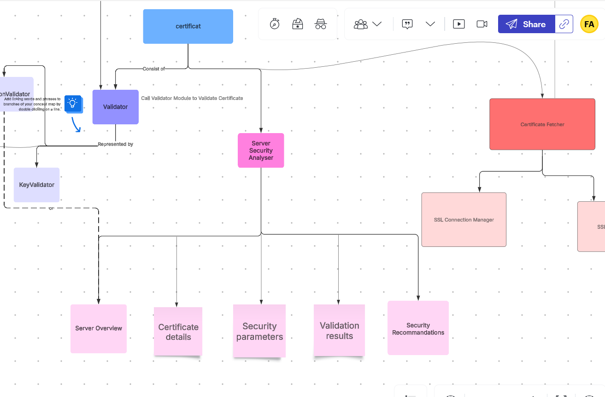
## Etape 5: a. Refactoring du module Server security analyser avec DP Builder, facade, factory et strategy
Suite à l'ajout d'un nouvelle fonctionalité permettant l'affichage des informations du serveur,
Le code source de l'application a été transformé en utilisant plusieurs designs patterns
ci-dessous l'architecture initiale de l'application:
Diagramme UML avant


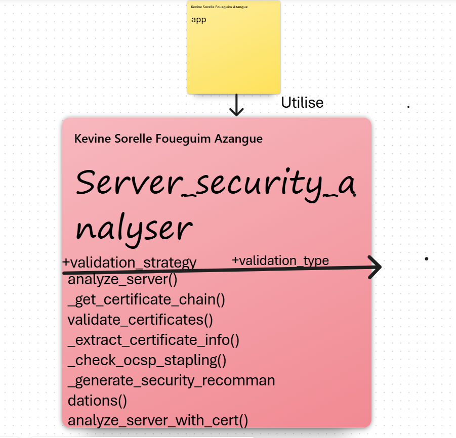

Diagramme UML après Intégration du design pattern Builder pour la construction du rapport de sécurité pour un server:

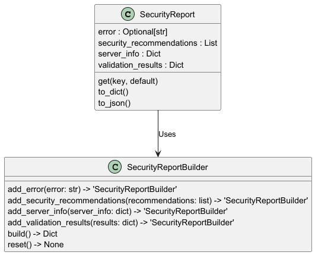

Intégration du design pattern strategy et factory pour l'analyse des informations serveurs:

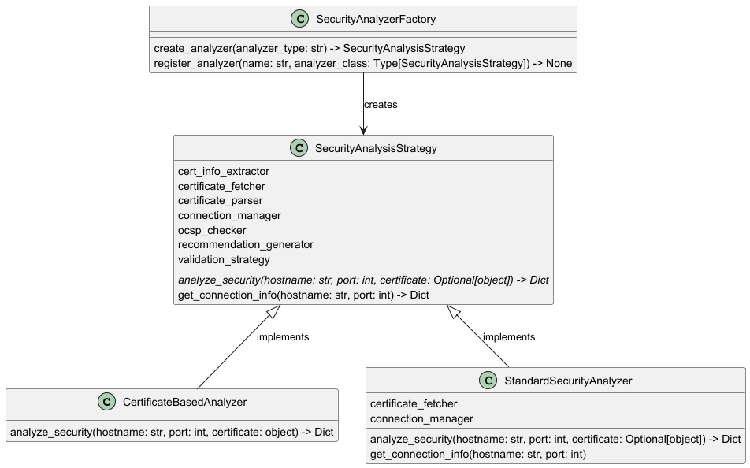

Intégration du design pattern facade pour encapsulation des informations de validation du serveur:

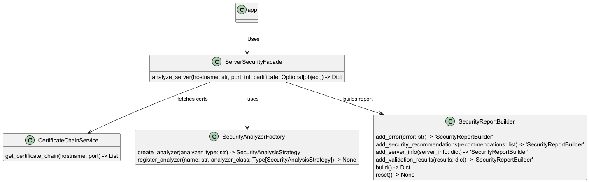

## Etape 5: b. Refactoring du module principal certificate validator DP Adapter
Auparant il y'avait qu'une seule possibilité d'analyser un certificat et c'était en télécharger le certificat d'un serveur distant
La fonction index de la classe main faisait appel à plusieurs modules afin d'effectuer la récupération du certificat.
Ci-dessous le diagramme UML avant:

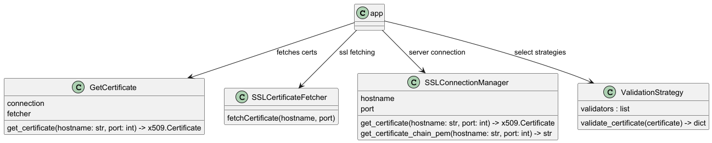

Suite à la mise à jour d'un nouveau mode de validation de certificat: validation par fichier, le DP adapter a été ajouté à l'outil
 Ci-dessous le diagramme UML après


## Etape 5: c. Refactoring du module generator DP Strategy et factory
Le module generator, auparavant constitué d'un seul fichier a été refactoré à l'aide des designs patterns factory et strategy

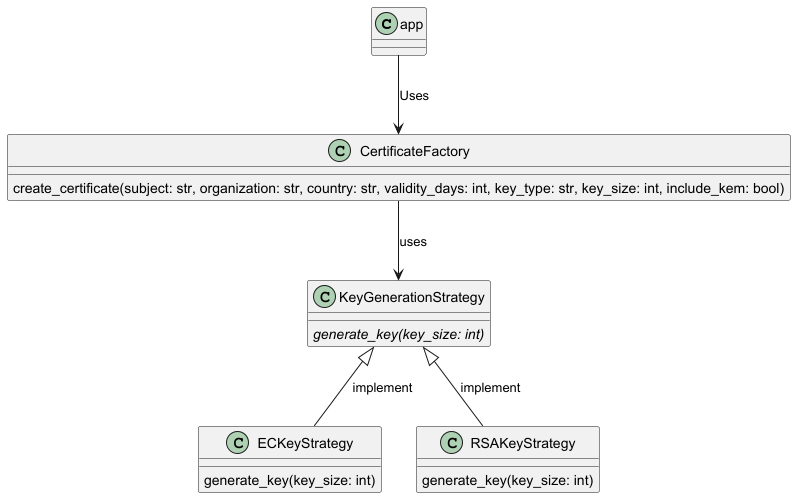

## Etape 5: d. Refactoring du module signature validator DP Strategy et factory
Le module signatureValidator, sous module du module validator implémenté avec le DP decorator a été refactoré à l
l'aide des designs patterns Strategy et factory. Auparavant, toute la logique de validation de la signature du certificat
était concentré dans un seul fichier. Ci-dessous le diagramme UML


## Conception de l'outil
Dans le cadre de ce projet, plusieurs design pattern(DP) seront utilisés.
Le premier est le DP Decorator utilisé pour la conception du module validator.
Ci-dessous l'architecture avant l'utilisation de la DP:

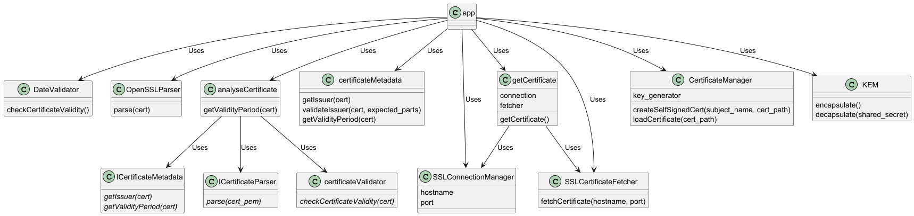

l'architecture après l'utilisation du DP:


Afin d'utiliser d'optimiser le processus de validation du certificat, deux autres design pattern ont été intégré à l'outil.
Il s'agit du design pattern Factory responsable du processus de création des classes de validation des propriétés du certificat. Ci-dessous l'architecture après intégration de ce DP:

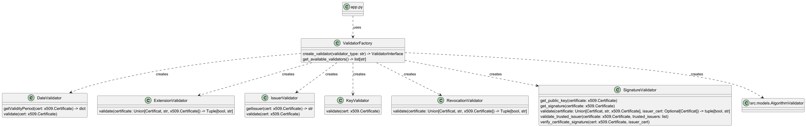

Afin de permettre la selection du type de validation à effectué, le DP strategy a été intégré dans l'architecture. Ci dessous le diagramme UML:

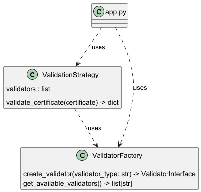

Pour finir, la nouvelle architecture du module validator avec le DP decorator utilisé initialement est le suivant:

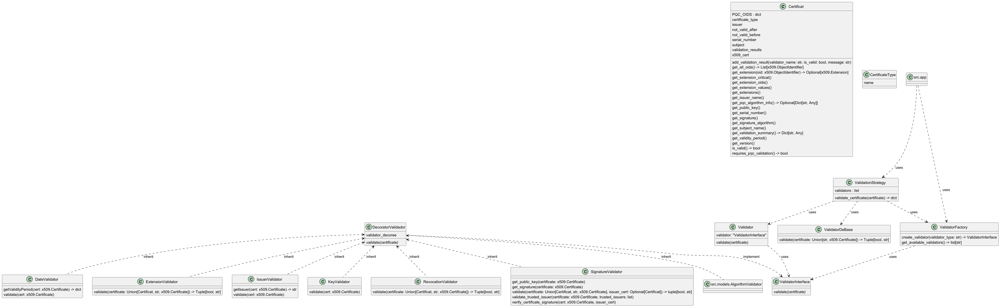

## Commandes pour exécuter le projet

1. **Installer les dépendances** :
   ```bash
   make install
   ```
2. **Lancer le serveur** :
   ```bash
   make run
   ```
3. **Accéder à l'application** :
   - Ouvrir votre navigateur et naviguer vers [http://localhost:5000](http://localhost:5000).

4. **Effectué les tests**
   ```bash
   make test
   ```

4. **Générer le rapport HTML de couverture** :
   ```bash
   make coverage-html
   ```

Pour nettoyer ou recompiler, utilisez :

```bash
make all
```

---

## Structure du Projet

```
Projet Implementation x.509 in TLS
├── src/
│   ├── app.py               # Contrôleur Flask
│   ├── adaptator/           # DP adaptator
│   ├── builder/             # DP builder
│   ├── config/              # fichier de config
│   ├── decorator/           # DP decorator
│   ├── enums/               # enums
│   ├── facade/              # facade
│   ├── factory/             # DP factory
│   ├── logs/                # fichier de log
│   ├── models/              # Modèles orientés objets
│   ├── sender/              # échange client/server
│   ├── services/            # Couche service
│   ├── static/              # documentation
│   ├── strategy/            # DP strategy
│   ├── templates/
│   │   ├ pages/             # Pages de l'aplication
│   │   ├ partials/          # Header et Footer et nav
│   ├── uml/                 # diagram UML
│   ├── utils/               # classes utils
├── Makefile                 # Commandes Make pour exécuter le projet
├── tests/
│   ├── certs/               # certificats de tests
│   ├── unit/                # unit test files
│   ├── integration/         # Integration test files
│   ├── performance/         # performance test files
```

---

## Auteure

- **Kevine Sorelle FOUEGUIM AZANGUE**
  - Code CIP : `fouk0792`

---